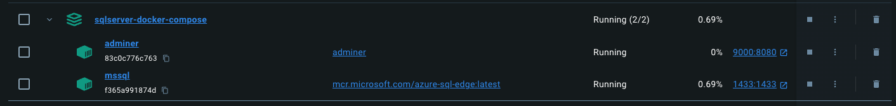
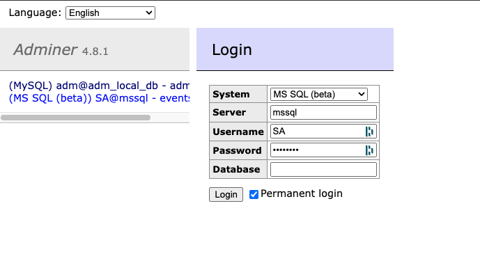

# launch Database 

## Installation 

you need to have docker installed

Clone the repository: `git clone https://github.com/vince/sqlserver-docker-compose.git`

## Run Database
- Start the Docker container: `make run-db`

or 
- Start the Docker container: `docker compose up -d`

Docker images 

## Access the SQL Server instance: 
- you can use adminer 
- http://localhost:9000

